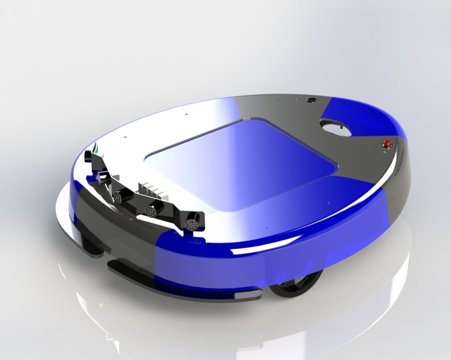

# Magabot
The Magabot is a low-cost open source robotics platform designed to give mobility to any portable computer (laptop on wheels concept). This is a entry level robot platform and it targets the edutainment market.

The platform includes the following main features:

- Low-level Arduino based electronics
- Differential drive based on 2 DC motors with encoders
- 3 IR ground sensors (to detect stairs or lines)
- 2 bumpers on the front (to detect collisions)
- 3 RGB LEDs (to show the status)
- 1 LiPO battery 11.1V 2.65A
- 5 sonar sensors

https://www.idmind.pt/mobilerobotics/magabot/

This repository contains the necessary programs for controlling the Magabot.

## Raspberry Pi
The Raspberry Pi runs controller programs that send movement commands to the Arduino.
These programs are run on the Raspberry Pi Model 4B which is connected to a camera.

The Raspberry Pi can accessed directly by connecting it to a keyboard, mouse and screen.
To access it through SSH, the command *ssh pi@raspberrypi.local* can be used as long as the computers are connected to the same network.

### magabot.py
This application combines the joystick and camera controllers.
Upon launch the Magabot can be controlled remotely by the joystick.
By pressing the "Y" button, the Magabot switches to the "follow me" mode, where the robot follows the person in the camera frame.
Press "B" button to return to remote control.

#### Current state
- Detect a person within a distance range of ~0.3-3.5 meters.
- Approach and stop around 30cm from the person.
- Signal if object is detected within sonar range, <50cm.
- Stop if Magabot's bumpers touches an object.

#### Next steps
- Identify specific persons, only follow the desired user.
- Use sonar readings for obstacle avoidance.
- Keep a set distance to the user.

### leash.py
This application builds on the joystick controller to enable the robot to follow a user holding a leash.
The leash is attached to a joystick mounted on the Magabot.
A highly elastic leash is recommended, as this will give the user freedom to move independently of the Magabot's speed.

#### Current state
- Follow user when the handheld controller is mounted on the Magabot and leash is attached to the left joystick.

#### Next steps
- Mount a single joystick on the Magabot, connected to the Raspberry Pi.
- Add a tension measurement sensor to the leash/joystick, enabling the Magabot to regulate its speed based on how far away the user is.
  

### Camera controller
This program uses the camera mounted on the Magabot to follow the user.

#### Current state
The program is able to detect a person and actuate the motors to approach the target.

#### Next steps
- Identify a specific person
- Estimate the distance to the user, and keep a stable position relative to them.
- Add input from joystick for emergency stop. (Can be done by running a version of the *controller_joystick.py* without the constant stop messages)

### Joystick controller
This program lets the user drive the Magabot from a handheld controller, and is adapted for the Logitech Wirelss Gamepad F710.
The controller can be connected to the Raspberry Pi through a USB Bluetooth adapter.

#### Current state
Control the Magabot's speed and direction.

## Arduino
Controls the physical aspect of the robot such as actuators and sensors.
The Arduino Uno is equipped with the *Magabot Shield" which is designed by IDMind.
The Raspberry Pi transmits movement commands to the Arduino via serial communication using the UART protocol. 

##### Hardware configuration
- RPi GPIO14 (TX) is connected to Arduino RX (Receive pin).
- RPi GPIO15 (RX) is connected to Arduino TX (Transmit pin).
- A common ground (GND) connection between the RPi and Arduino ensures proper signal referencing.

INSERT IMAGE OF THE CONNECTIONS

##### Command Structure
Each movement command consists of a byte array transmitted from the RPi to the Arduino.
The command contains the following data:
- Motor control byte (0x86): Identifies the message as a motor control command.
- Left and right motor speeds: Each motor speed is represented by 1 byte (range: 0-255).
- Direction bytes: Indicate motor direction (0 for forward, 1 for backward).
- Format: 'motor_byte, vel1, dir1, vel2, dir2' (e.g. bytes([0x86, 0x05, 0x00, 0x05, 0x00]) for driving slowly forwards)

##### Serial Communication Setup
The RPi communicates with the Arduino over a 9600 baud rate using the pySerial library.
Commands are sent periodically (with a short delay) to ensure smooth control of the motors.

#### Current state
- Will execute the movement commands provided by the controllers.
- Stops the motors if the bumper sensors are pressed.
- Read the sonar measurements.

#### Next steps
- Implement functionality for utilizing the sonar readings for obstacle avoidance and speed control.

### ESP32
This wifi module can be used to interface with the Arduino from a remote computer.
Note: This component was replaced by the Raspberry Pi to make the Magabot more generalizable, but can easily be re-installed by swapping the UART connectors.

## Computer vision
The MobileNetSSD is a pre-trained computer vision model for detecting objects.
For this project we have chosen to use this model for detecting when a person is deteted within the camera frame.
